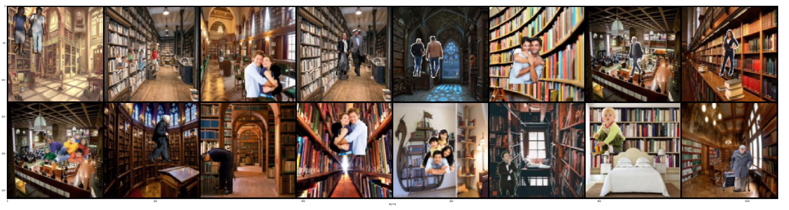
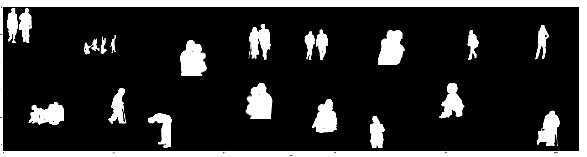
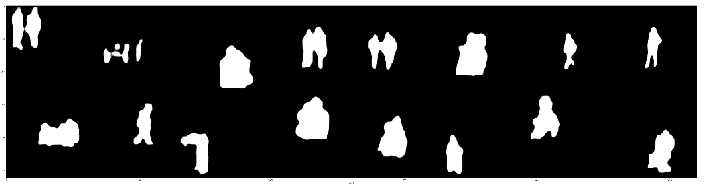
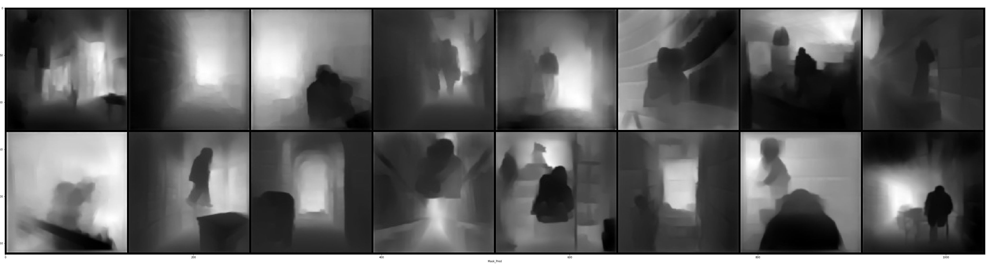
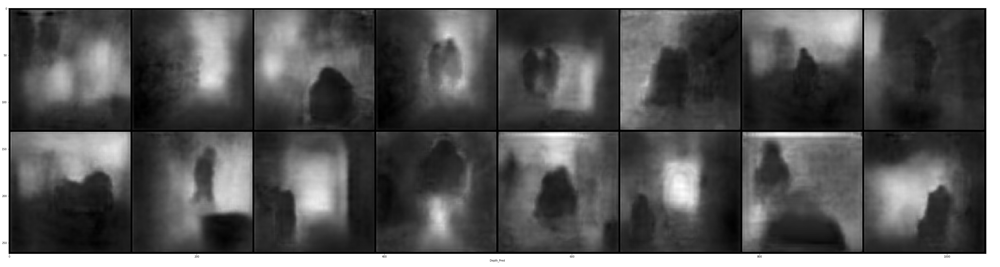

# Data
Following is link of all the zipped files for data
https://drive.google.com/open?id=1X05V9XVTkou_kCnVBqefXfZhvPNm5aHd
Data has basically four main parts.
i. Background images: These are images mainly taken from interior of library
ii. Foreground+Background images: These are images in which we have superposed humans in background images. These are total 400K images
iii. Mask Images: These are images in which we have extracted mask images from superposed humans in background images. These are total 400K images
iv. Depth Images: These are images in which we have extracted depth images from superposed humans in background images. These are total 400K images
Please note Foreground+Background, Mask and depth have 4 zipped files each, each having 100k images based on generation process in our group 

# Training

Following is path of main .ipynb file used for training and testing
https://github.com/gdeotale/EVA4/blob/master/Week15/15b__.ipynb

Following is path of Model used:
https://github.com/gdeotale/EVA4/blob/master/Week15/Net/Model.py

Model Summary

==============================================

Total params: 677,824
Trainable params: 677,824
Non-trainable params: 0

-----------------------------------------------

Input size (MB): 0.19
Forward/backward pass size (MB): 541.25
Params size (MB): 2.59
Estimated Total Size (MB): 544.02

-----------------------------------------------

SGD has been used as optimizer and i manually tuned lr per epoch based on changed in training and testing loss. Started lr from 0.01

Total loss = 1Xmask_loss + 2Xdepth_loss
Reason behind giving more weightage to depth loss was based on simple observation that depth loss remained more than mask loss
also the mask images were quick in attaining good results.
(Tried L1 loss, Smooth L1 loss, Bce with logit loss, MSE loss, SSIM loss). As per my observation BCEwithlogitloss performed well for mask images
but didn't perform well for depth images. L1 and Smotth L1 have fairly good accuracy for depth and mask images so our training has mixture of both losses.
Tried MSE or L2 loss, but it didn't have good output for mask as well as depth images, so stopped training for that after 1 epoch.
SSIM performed bad for depth images, so didn't check its performance for mask images.

I have trained model for 12 epochs, first 6 epochs with L1loss for both mask and depth and remaining 6 with SmoothL1loss for
both depth and mask. Although in smoothL1 loss loss seems to be smaller than L1 loss, but the IOU which we used as metric for 
accuracy in both mask and depth to compare with target remains the same.
 We have plotted training and testing loss separately using tensorboard. Following is link for the same
 https://github.com/gdeotale/EVA4/tree/master/Week15/Plots

Train Plots
train_iou_depth.png
train_iou_mask.png
train_loss_depth.png
train_loss_mask.png

Test plots 
dice_loss_depth.png
dice_loss_mask.png
test_iou_depth.png
test_iou_mask.png
test_loss_depth.png
test_loss_full.png
test_loss_mask.png
Note: In addition to IOU, i have used Dice loss as a measure of accuracy to match against target.

From plots following things can be identified:
Best train IOU for Depth images is 0.67
Best train IOU for Mask images is 0.91
Best L1loss for depth Images is 0.07
Best L1loss for mask images is 0.05

Best test IOU for Depth images is 0.63
Best test IOU for Mask images is 0.9
Best test L1loss for depth Images is 0.075
Best test L1loss for mask images is 0.055
Best test Dice coefficient for Depth images is 0.04
Best test Dice coefficient for Mask images is 0.031

Test Accuracy for all 12 epochs including loss, iou and dice_loss have been saved in following file
https://github.com/gdeotale/EVA4/blob/master/Week15/Output.txt

At the end of 12th epoch following is test result

Epoch 12 Avg test loss:  0.24702741133570671  Avg mask loss:  0.06406917095233997  Avg depth loss:  0.0914791201243798
Avg mask iou:  0.8793281796959914  Avg depth iou:  0.5493079498816392
Avg mask dice loss:  0.037927588431040445  Avg depth dice loss:  0.05688627901077271

All the model trained were saved at 
https://github.com/gdeotale/EVA4/tree/master/Week15/Models_pt

# Zip file extraction
We have extracted !unzip command to unzip all 1200k+100 images in /content/ZData/ folder. Please note that unzipping in 
/content folder is important as data is loaded in cache memory and using data from the same folder is good enough for training.

# Output Images

Following is shareable link for Result_Image folder. 
https://drive.google.com/open?id=1EQBOTg3f3De8JthrgOpvm4r5g8pJ5Rp8
It has 2 folders,
i. Output_Train: Images generated at end of every 500 batches of size 32 each. It has folders from 1 to 12 basically indicating 
epoch number
ii. Output_Test: Images generated at end of every 500 batches of size 32 each. It has folders from 1 to 12 basically indicating 
epoch number

following is our result at end of 12th epoch...
1. Background+Foreground Images

2. Actual Mask

3. Predicted Masks

4. Actual depth

5. Predicted Depth

#Observations:

Although the model has been trained for 12 epochs but didn't find considerable decrease in loss or iou score post 4th epoch.
Even change in loss from L1 to Smooth L1 although decreased loss significantly but wasn't able to increase IOU score. So
decrease in loss can't be attributed to improvement in performance here.
